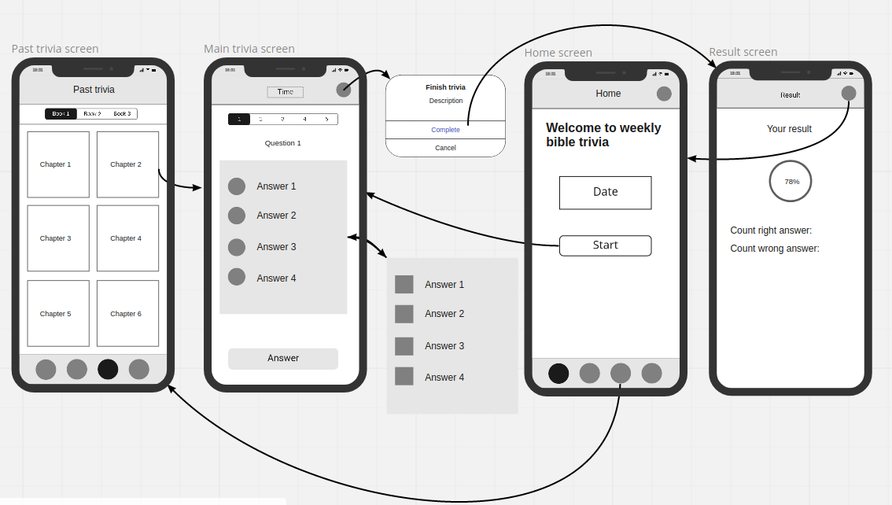
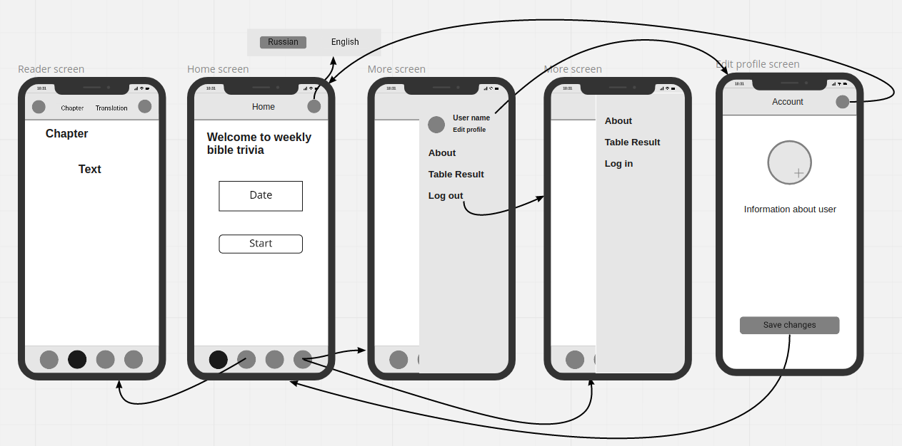
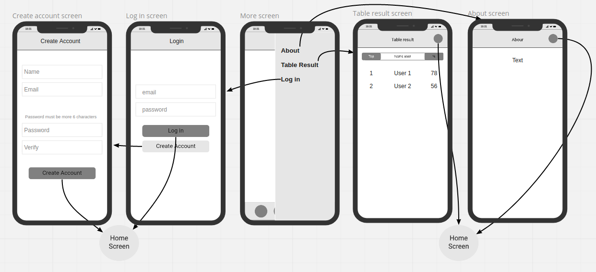
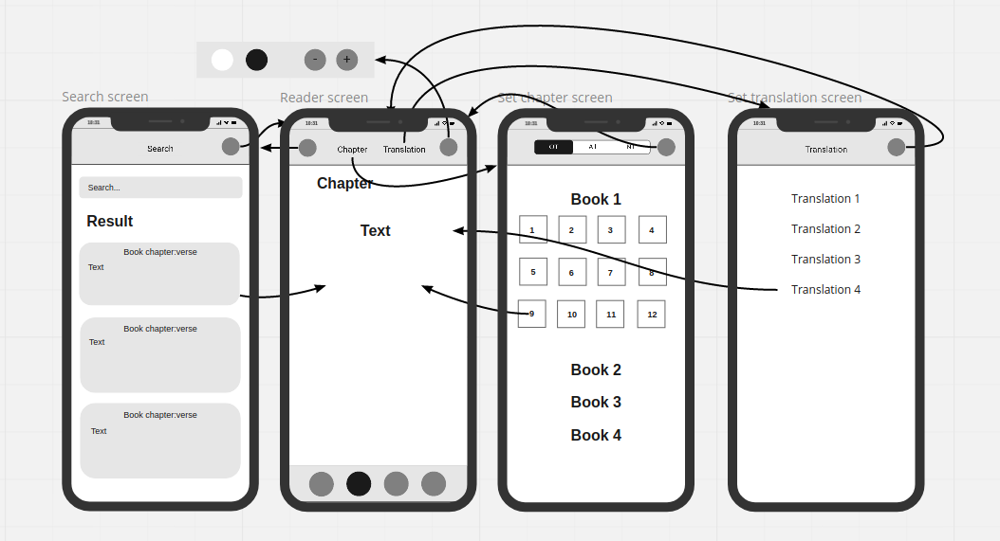

# Weekly bible trivia

### Buttons at the bottom bar of the screen:
* Home
* Bible
* Past trivia
* More

## 1. Part 1
### 1.1 Home screen:
I get information about current date and date next trivia. 
I can start trivia if current date equal to date next trivia. 
I have opportunity change language app.

Buttons:
* Change language
* Start trivia

### 1.2 Past trivia screen:
I can choose  trivia of interest to me from the past.

Buttons:
* List books
* List chapters

### 1.3 Main trivia screen:
I am answering or skipping question. Conform complete trivia.

Buttons:
* List with numbers question
* List with radio buttons or checkbooks
* Answer

### 1.4 Result screen:
I see percent right answers. I can go on home screen.

Button:
* Close

## 2. Part 2
### 1.1 Home screen:
I get information about current date and date next trivia.
I can start trivia if current date equal to date next trivia.
I have opportunity change language app.

Buttons:
* Change language
* Start trivia

### 2.2 Reader screen:
I choose chapter and verse interesting for me. Swipe may make next page. 
I can switch translation. I can search need place by keyword. 
I have opportunity change size font and theme app.

Buttons:
* Search
* Set chapter and verse
* Set translation
* Setting

### 2.3 More screen(user wasn't auth):
I pick the right ones from the drop-right menu

Buttons:
* About
* Table result
* Log in

### 2.4 More screen(user was auth):
I pick the right ones from the drop-right menu

Buttons:
* Edit profile
* About
* Table result
* Log out

### 2.5 Edit profile screen:
I see information about my profile. I can set Image.

Buttons:
* Add image
* Save changes
* Cancel

## 3. Part 3
### 3.1 More screen(user wasn't auth):
I pick the right ones from the drop-right menu

Buttons:
* About
* Table result
* Log in

### 3.2 About screen:
I see information about application

Button:
* Cancel

### 3.3 Table result:
Table show results last trivia. 
I see place, name, percent right answers other users.

Button:
* Cancel

### 3.4 Log in screen:
I'm required to identify myself

Fields:
* Email
* Password

Buttons:
* Log in
* Create Account

### 3.5 Create Account screen:
I'm entering data for create new account and clicking button "Create Account"

Fields:
* Name
* Email
* Password
* Verify

Buttons:
* Create Account

## 4. Part 4 (No urgency)
### 4.1 Reader screen:
I choose book and chapter interesting for me. Swipe may make next or prev page.
I can switch translation. I can search need place by keyword.
I have opportunity change size font and theme app.

Buttons:
* Search
* Set chapter
* Set translation
* Setting

### 4.2 Search screen:
I can search need places by keyword

Field:
* Search

Buttons:
* List responses
* Cancel

### 4.4 Set chapter screen:
I can choose book and chapter.

Buttons:
* List books
* List chapters
* Cancel

### 4.5 Set translation screen:
I can choose need translation

Buttons:
* List translation
* Cancel

